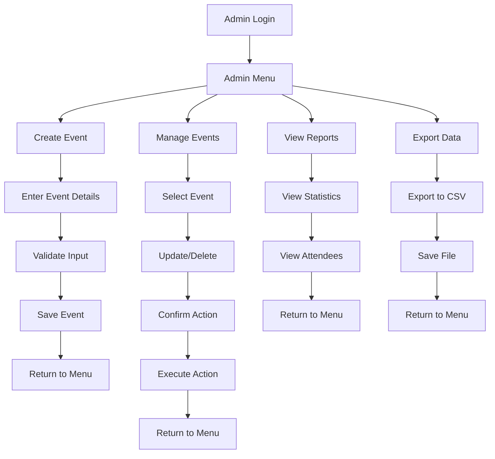
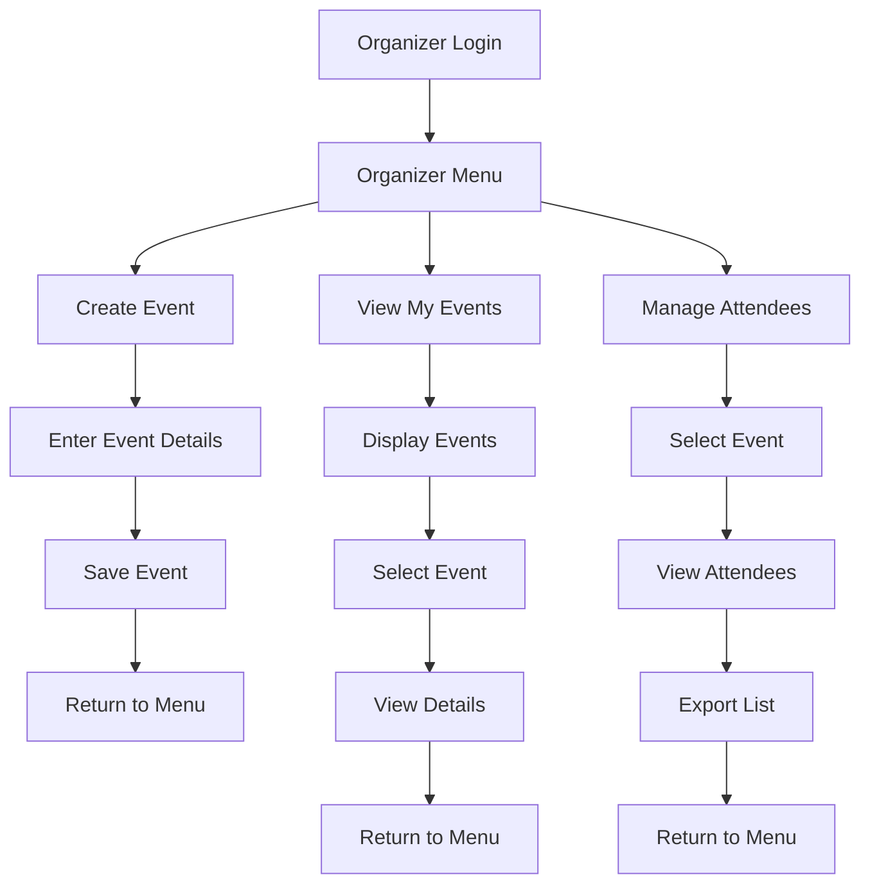
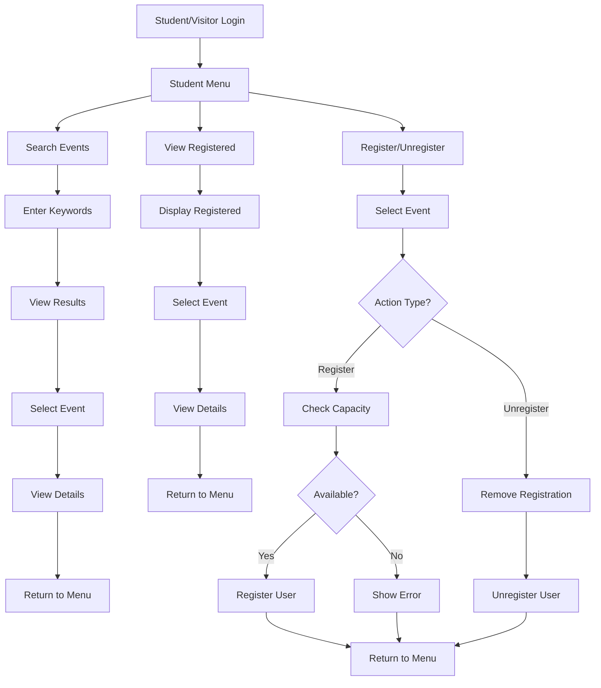
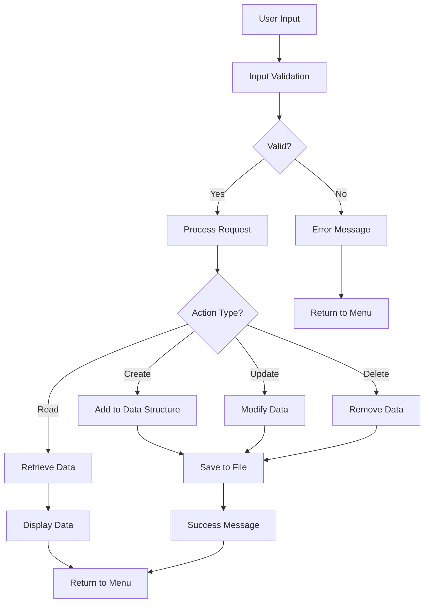
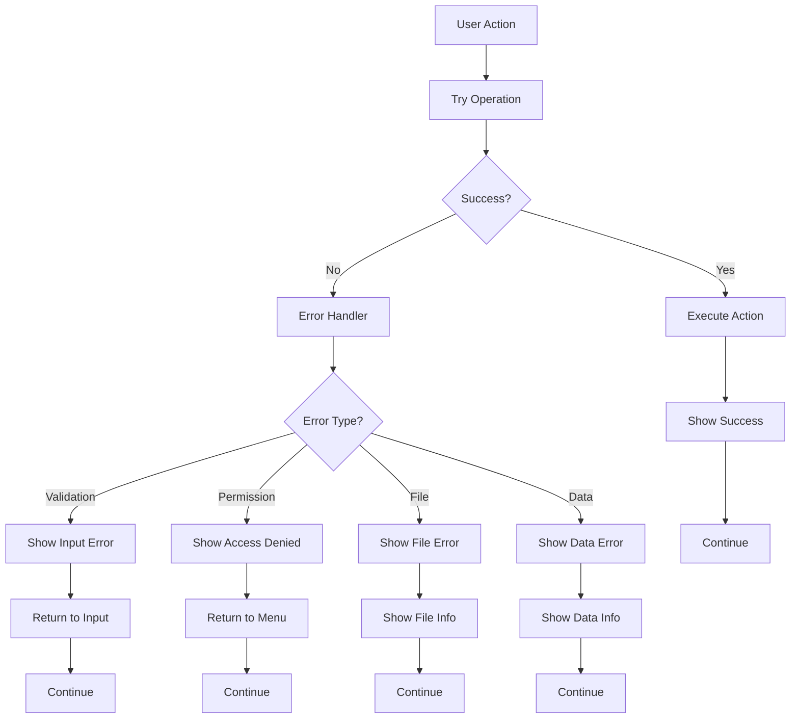

# Campus Event Management System - User Interaction Flowchart

## System Flow Overview

```mermaid
flowchart TD
    A[Start System] --> B[Display Main Menu]
    B --> C{User Logged In?}
    
    C -->|No| D[Login Menu]
    C -->|Yes| E[Role-Based Menu]
    
    D --> F[1. Login]
    D --> G[2. Register New User]
    D --> H[3. Exit]
    
    F --> I[Enter User ID]
    I --> J{Valid User ID?}
    J -->|No| K[Show Error - Return to Login]
    J -->|Yes| L[Set Current User - Show Role Menu]
    
    G --> M[Enter User Details]
    M --> N[Select Role]
    N --> O[Generate User ID]
    O --> P[Save User Data]
    P --> Q[Show Success Message]
    
    E --> R{User Role?}
    
    R -->|Admin| S[Admin Menu]
    R -->|Event Organizer| T[Organizer Menu]
    R -->|Student/Visitor| U[Student/Visitor Menu]
    
    S --> V[1. Create Event]
    S --> W[2. Update Event]
    S --> X[3. Delete Event]
    S --> Y[4. View All Events]
    S --> Z[5. View Event Attendees]
    S --> AA[6. View Statistics]
    S --> BB[7. Export Events to CSV]
    S --> CC[8. Export Attendees to CSV]
    S --> DD[9. Logout]
    
    T --> EE[1. Create Event]
    T --> FF[2. View My Events]
    T --> GG[3. View Event Attendees]
    T --> HH[4. Export Attendees to CSV]
    T --> II[5. Logout]
    
    U --> JJ[1. Search Events]
    U --> KK[2. View Registered Events]
    U --> LL[3. Register for Event]
    U --> MM[4. Unregister from Event]
    U --> NN[5. Logout]
    
    V --> OO[Enter Event Details]
    OO --> PP{Valid Input?}
    PP -->|No| QQ[Show Error - Return to Menu]
    PP -->|Yes| RR[Create Event - Save Data]
    
    W --> SS[Select Event to Update]
    SS --> TT[Enter New Values]
    TT --> UU[Update Event - Save Data]
    
    X --> VV[Select Event to Delete]
    VV --> WW[Confirm Deletion]
    WW -->|Yes| XX[Delete Event - Update Data]
    WW -->|No| YY[Return to Menu]
    
    Y --> ZZ[Display All Events]
    ZZ --> AAA[Return to Menu]
    
    Z --> BBB[Select Event]
    BBB --> CCC[Display Attendees]
    CCC --> DDD[Return to Menu]
    
    AA --> EEE[Calculate Statistics]
    EEE --> FFF[Display Results]
    FFF --> GGG[Return to Menu]
    
    BB --> HHH[Generate CSV Report]
    HHH --> III[Save File]
    III --> JJJ[Return to Menu]
    
    CC --> KKK[Select Event]
    KKK --> LLL[Generate Attendee CSV]
    LLL --> MMM[Save File]
    MMM --> NNN[Return to Menu]
    
    EE --> OO
    FF --> OOO[Display My Events]
    OOO --> AAA
    
    GG --> BBB
    HH --> KKK
    
    JJ --> PPP[Enter Search Keyword]
    PPP --> QQQ[Display Matching Events]
    QQQ --> RRR[Return to Menu]
    
    KK --> SSS[Display Registered Events]
    SSS --> TTT[Return to Menu]
    
    LL --> UUU[Select Event]
    UUU --> VVV{Can Register?}
    VVV -->|No| WWW[Show Error]
    VVV -->|Yes| XXX[Register User - Update Data]
    
    MM --> YYY[Select Event]
    YYY --> ZZZ{Is Registered?}
    ZZZ -->|No| AAAA[Show Error]
    ZZZ -->|Yes| BBBB[Unregister User - Update Data]
    
    DD --> CCCC[Clear Current User]
    II --> CCCC
    NN --> CCCC
    CCCC --> B
    
    H --> DDDD[Exit System]
    
    K --> D
    QQ --> S
    YY --> S
    WWW --> U
    AAAA --> U
```

## Detailed User Journey Flows

### 1. Admin User Journey

### 2. Event Organizer Journey

### 3. Student/Visitor Journey

## Data Flow Diagram

## Error Handling Flow

## Key Interaction Points

### 1. Authentication Flow
- User enters User ID
- System validates against stored users
- Sets current user context
- Displays role-appropriate menu

### 2. Event Management Flow
- Admin/Organizer creates event
- System validates all inputs
- Event is saved to data structure
- Data is persisted to file

### 3. Registration Flow
- Student/Visitor searches events
- Selects event to register
- System checks capacity and duplicates
- Registration is processed and saved

### 4. Reporting Flow
- Admin requests statistics
- System calculates metrics
- Results are displayed
- Optional CSV export

### 5. Data Persistence Flow
- All changes trigger save operation
- Data is serialized to JSON
- Files are written to disk
- Error handling for file operations

## Security Considerations

### Access Control Points
1. **Menu Access**: Role-based menu display
2. **Function Access**: Permission checks before operations
3. **Data Access**: Role-based data visibility
4. **File Access**: Secure file operations

### Validation Points
1. **Input Validation**: All user inputs are validated
2. **Data Validation**: Business logic validation
3. **State Validation**: System state consistency checks
4. **File Validation**: File integrity checks

This flowchart demonstrates the comprehensive user interaction patterns and system flow for the Campus Event Management System, showing how different user roles interact with the system and how data flows through the application. 